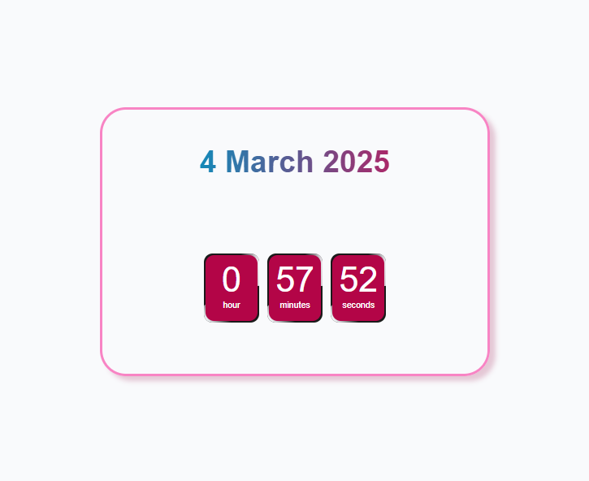

# Digital Clock

This is a simple digital clock web application built using **HTML, CSS, and JavaScript**. It dynamically displays the current date and time, updating every second.

## Screenshots


## Features
- Displays the current date in the format: `Day Month Year` (e.g., 4 March 2025).
- Shows the time with hours, minutes, and seconds, updating in real-time.
- Uses JavaScript's `setInterval()` function to refresh the clock every second.

## Technologies Used
- **HTML** - Structure of the webpage.
- **CSS** - Styling the clock for better appearance.
- **JavaScript** - Logic for updating the date and time dynamically.

## How to Run
1. Clone the repository or download the files.
   ```sh
   git clone https://github.com/jaysreeb/DigitalClock.git
   ```
2. Open the `index.html` file in any web browser.

## Project Structure
```
/digital-clock
│── index.html       # Main HTML file
│── styles.css       # CSS for styling
│── script.js        # JavaScript logic for the clock
│── README.md        # Project documentation
```

## JavaScript Logic
The `script.js` file does the following:
- Gets the current date and time using `new Date()`.
- Updates the elements with the correct values every second.
- Update the HTML DOM element text content.

## Future Improvements
- Add an AM/PM toggle for 12-hour format.
- Provide different time zone support.
- Improve UI with animations and themes.

## Author
**Jaysree** - [GitHub Profile](https://github.com/jaysreeb)

## License
This project is open-source and available under the **MIT License**.

## I learned the CSS from this video :
https://www.youtube.com/watch?v=RMX2covTBps 
